# 🧠✨ SilentSpace - AI Psychology Chatbot

  
  
  
  ### *Your Compassionate Digital Companion for Mental Wellness* 🌱
  
  
  
  
  
  
  *🚀 Revolutionizing mental health support through cutting-edge AI technology*
  

---

## 🌟 **Why SilentSpace?**

> *"In a world where mental health matters more than ever, SilentSpace bridges the gap between technology and human compassion."*

<table>
<tr>
<td width="50%">

### 🎯 **The Problem**
- 1 in 4 people struggle with mental health issues
- Limited access to professional help
- Stigma around seeking support
- Need for immediate, judgment-free assistance

</td>
<td width="50%">

### ✅ **Our Solution**
- 24/7 AI-powered empathetic conversations
- Complete privacy and anonymity
- Instant support whenever you need it
- Beautiful, calming user experience

</td>
</tr>
</table>

---

## 🚀 **Features That Make Us Special**

| 🤖 **AI-Powered Intelligence** | 🌙 **Adaptive Themes** | 🎨 **Personalization** |
|:---:|:---:|:---:|
| Advanced conversational AI with deep empathy training | Seamlessly switch between dark & light modes | Comprehensive color customization for your comfort |

| 💬 **Real-time Chat** | 🔒 **Privacy First** | 📱 **Universal Access** |
|:---:|:---:|:---:|
| Lightning-fast responses with timestamps | Your conversations stay completely private | Perfect experience on any device, anywhere |

---

## 🛠️ **Cutting-Edge Tech Stack**

```mermaid
graph LR
    A[⚛️ React 19] --> B[📘 TypeScript]
    B --> C[🎨 Tailwind CSS]
    C --> D[🔥 Modern UI]
    D --> E[⚡ Lightning Fast]
    E --> F[🌟 SilentSpace]
```

<table align="center">
<tr>
<td align="center">

 <strong>React 19</strong>
 <em>Latest & Greatest</em>
</td>
<td align="center">

 <strong>TypeScript</strong>
 <em>Type Safety</em>
</td>
<td align="center">

 <strong>Tailwind CSS</strong>
 <em>Modern Styling</em>
</td>
<td align="center">

 <strong>Lucide React</strong>
 <em>Beautiful Icons</em>
</td>
</tr>
</table>

---

## 🎮 **Getting Started in 3 Simple Steps**

### 1️⃣ **Enter the Space** 
*Visit our live demo and step into your safe digital sanctuary*

### 2️⃣ **Personalize Your Experience**
*Choose your preferred theme and colors that resonate with you*

### 3️⃣ **Start Your Journey**
*Begin meaningful conversations with your AI companion*

---

## 🎨 **Visual Experience**

### 🌅 **Light Mode - Serene & Peaceful**
*Clean, minimalist design for daytime clarity*

### 🌃 **Dark Mode - Calm & Focused** 
*Gentle on the eyes for evening conversations*

### 🎭 **Custom Colors - Your Personal Touch**
*Make it uniquely yours with our advanced color picker*

---

## 💡 **How to Use SilentSpace**

<strong>🗣️ Starting Conversations</strong>

 

- Simply type your thoughts, feelings, or concerns
- Press `Enter` or click the elegant **Send** button
- Experience immediate, thoughtful responses

<strong>🨠Customizing Your Space</strong>

 

- **Theme Toggle**: Switch between light/dark modes instantly
- **Color Picker**: Access advanced customization options
- **Personal Touch**: Make the interface reflect your personality

<strong>🔄 Managing Conversations</strong>

 

- **Clear Chat**: Start fresh whenever you need to
- **Timestamps**: Track your conversation flow
- **Privacy**: Your data stays secure and private

---

## ⚠️ **Important Guidelines**

<table>
<tr>
<td align="center" width="33%">

### 🤝 **Supportive Companion**
SilentSpace is designed to be your empathetic digital friend, offering support and understanding.

</td>
<td align="center" width="33%">

### 👨‍⚕️ **Not a Replacement**
While we provide great support, we're **not** a substitute for professional mental health care.

</td>
<td align="center" width="33%">

### 🚨 **Serious Concerns**
For urgent mental health needs, please reach out to qualified professionals immediately.

</td>
</tr>
</table>

---

## 🌟 **What Makes Us Different**

<blockquote align="center">
<em>"SilentSpace isn't just another chatbot - it's a carefully crafted digital sanctuary where technology meets human compassion."</em>
</blockquote>

- **🧠 Empathy-Trained AI**: Our AI understands the nuances of human emotion
- **🎯 Purpose-Built**: Specifically designed for mental wellness support
- **🔮 Modern Architecture**: Built with the latest web technologies
- **💝 Community-Driven**: Created with love for those who need support

---

## 🚀 **Ready to Experience SilentSpace?**

*Your journey to better mental wellness starts with a single click* ✨

---

## 🤝 **Contributing & Support**

**Love SilentSpace? Here's how you can help:**

---

## 📄 **License & Legal**

**📚 Educational Purpose** | **🔒 Privacy Focused** | **🌱 Open Source Spirit**

*This project is created for educational purposes and mental health awareness.*

---

### 💜 **Made with Love for Mental Health Awareness**

*If SilentSpace has helped you or someone you know, consider sharing it with others who might benefit* 🌟

**⭐ Star this repository if you found it helpful!**

---

🔗 **Links:** [Live Demo](https://silent-space-3mh5ddh0r-lovepreets-projects-7b59e035.vercel.app/) | [Documentation](#) | [Support](#) | [Community](#)

